# Cloud Computing

Fundamental attributes of cloud computing:
* On-demand service
* Network access
* Ressource pooling
* Rapid elasticity
* Measured service
<a/>

# Google Cloud

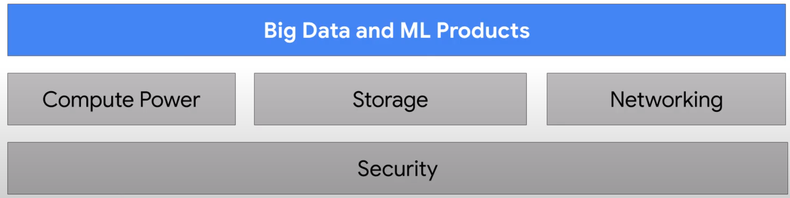

Storage and Compute ressources are connected with an 1 Petbit/sec connection.

## Big Data Team

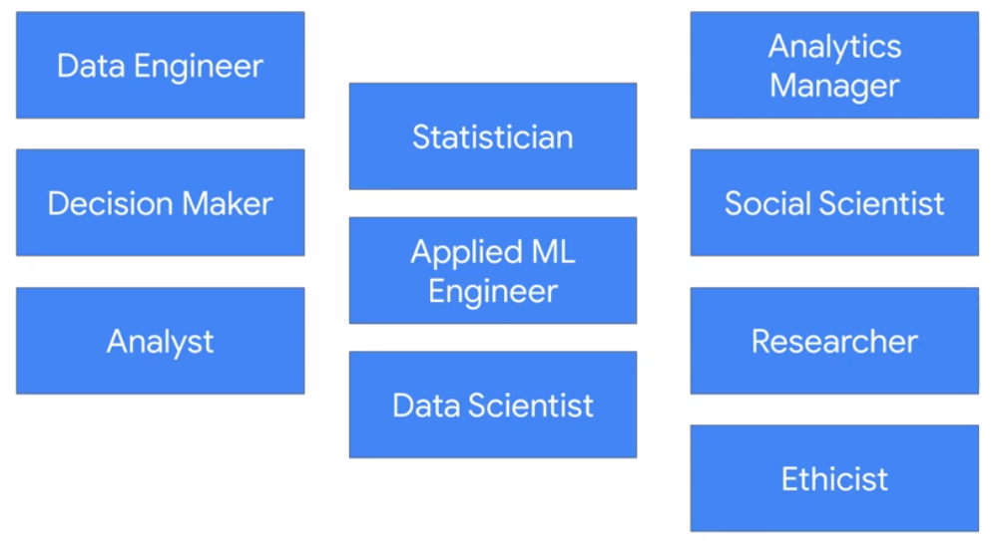

## Resource Hierarchy

Organization > Folder > Project > Resource

|Compute|Storage|Big Data|Cloud AI|
|-|-|-|-|
|Computer Engine (IAAS)|Cloud Bigtable|BigQuery|Vertex AI|
|Google Kubernetes GKE|Cloud Storage|Pub/Sub|Vision AI|
|App Engine (PAAS)|Cloud SQL|Dataflow|Speech-to-Text|
|Cloud Function (FAAS)|Cloud Spanner|Dataproc|AutoML|
||Cloud Datastorage|Notebooks|Tranaslation|

## Services

### Compute

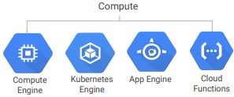

* Dataproc = Apache Hadoop

### Storage

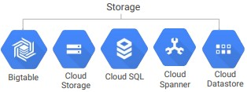

### Big Data

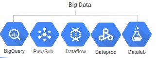

* Bigtable = Apache HBase

### Machine Learning

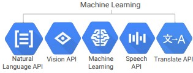

## Compute

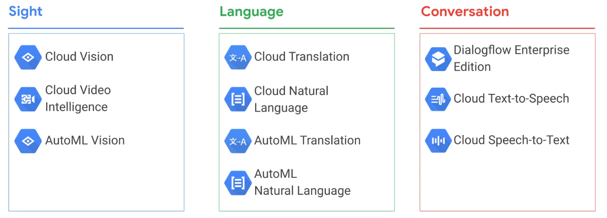

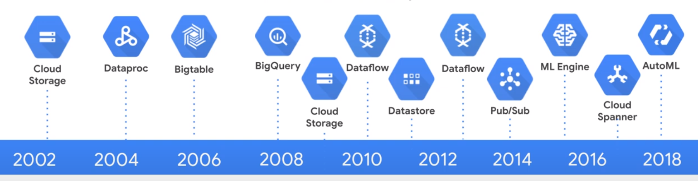

### Architectures

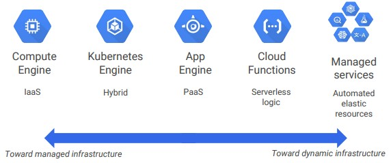

## Storage

* Standard: Hot data
* Nearline: once per month
* Coldline: once a quarter
* Archive: Backup

    $ gsutil cp sales*.csv gs://acme-sales/data/

## Network

Google network 10 GB/s

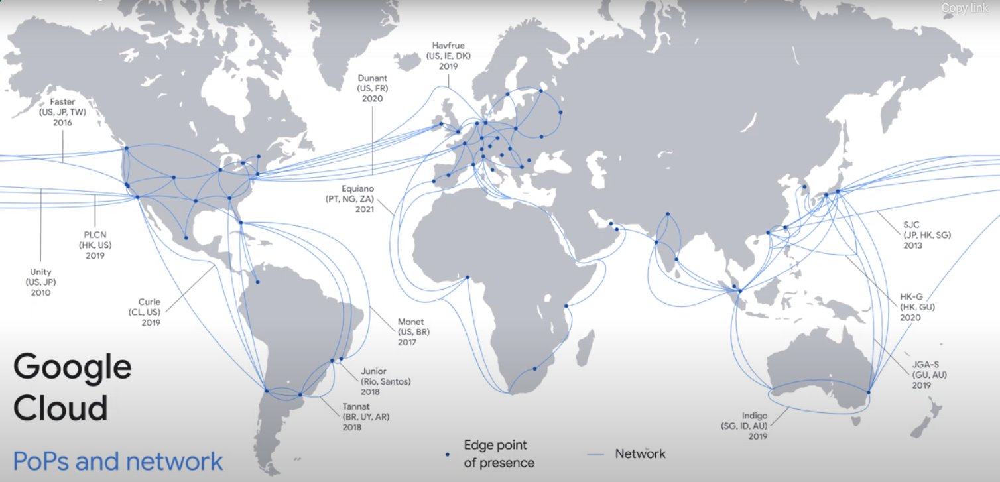

### Regions and Zones

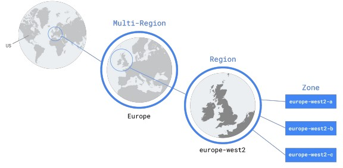

* Region < 5ms latency
* Multi-Regional Services: App Engine, Cloud Datastore, Cloud Storage, BigQuery
<a/>

## Security

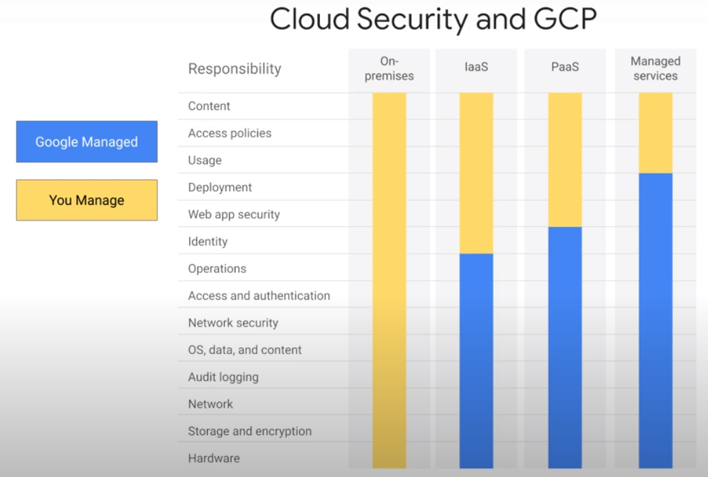

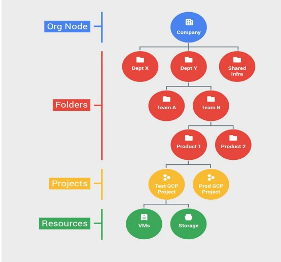

## IAM

IAM (Identity and Access Management) defines WHO, can do WHAT, on which RESOURCE.

### WHO

* Google account of Cloud Identity user: test@gmail.com
* Service account: test@project_id.iam.gserviceaccount.com
* Google group: test@googlegroups.com
* Cloud identity of G Suite domain: example.com
<a/>

### WHAT

Instance Admin > Role

|Service|Resource|Verb|
|-|-|-|
|compute|instances|list|
|compute|instances|delete|
|compute|instances|start|

### On which RESOURCE

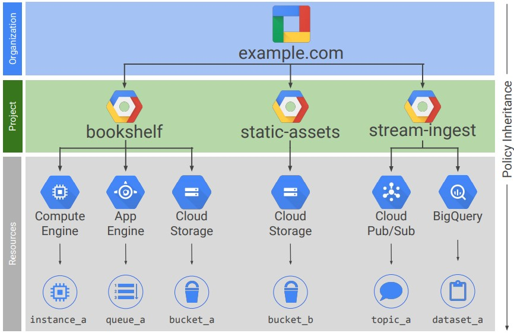

* A policy is set on a resource

## Roles

* Primitive
* Predefined
* Custom
<a/>

### Primitve Roles

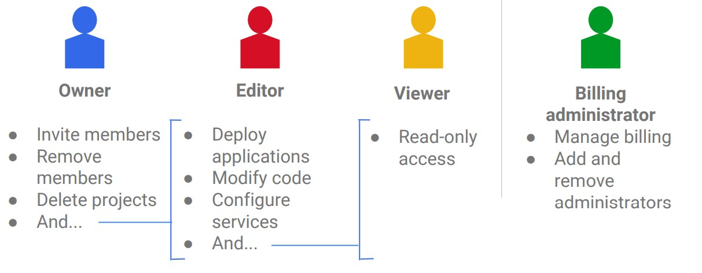

### Predefined Roles

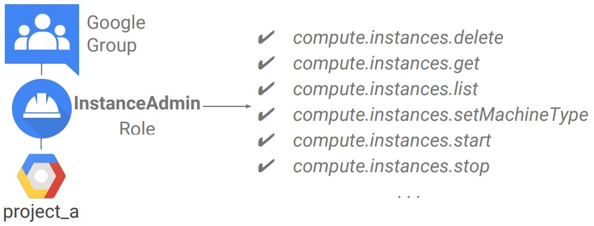

### Custom Roles

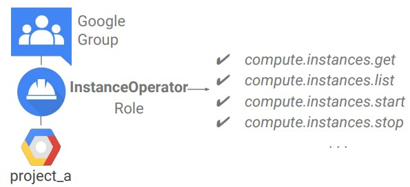

## Service Accounts

* Provide an identity for carrying out server-to-server interactions in a project
* Used to authenticate from one service to another
* Control Privileges used by resources
* Indentified with an email address:
    * PROJECT_NUMBER-compute@developer.gserviceaccount.com
    * PROJECT_ID@appspot.gserviceaccount.com
<a/>

## [Google Cloud SDK](https://cloud.google.com/sdk/cloudplatform)

* gcloud
* gsutil (Cloud Storage)
* bq (Big Query)
<a/>

* Available as (Docker Image)[https://hub.docker.com/r/google/cloud-sdk/]
* Available via Cloud Shell
<a/>

## RESTful APIs

Programmatic access to products and services. Enabled through the Google Cloud Platform Console. The [API Explorer](https://developers.google.com/apis-explorer/) is an interactive tool that lets you easily try Google APIs using a browser.  

# Virtual Machines

## Virtual Private Cloud Network

* Each VPC network is contained in a GCP project.
* Cloud VPC networks are global, subnets are regional
<a/>

## Load-Balancing

|Global HTTP(S)|Global SSL Proxy|Global TCP Proxy|Regional|Reginoal internal|
|-|-|-|-|-|
|Layer 7|Layer 4|Layer 4|Any Traffic|Traffic inside VPC|

## Cloud CDN

Cache Content close to users

## Interconnection Options

|VPN|Direct Peering|Dedicated Interconnect|Carrier Peering|Partner Interconnect|
|-|-|-|-|-|
|Secure mulit-Gbps connection over VPN tunnels|Private connection between you and Google for your hybrid cloud workloads|Connect N x 10G transport circuits for private cloud traffic to Google Cloud at Google POPs|Connection through the largest partner network of service providers|Connectivity between  you on-premises network and your VPC network through a supported service provider|
