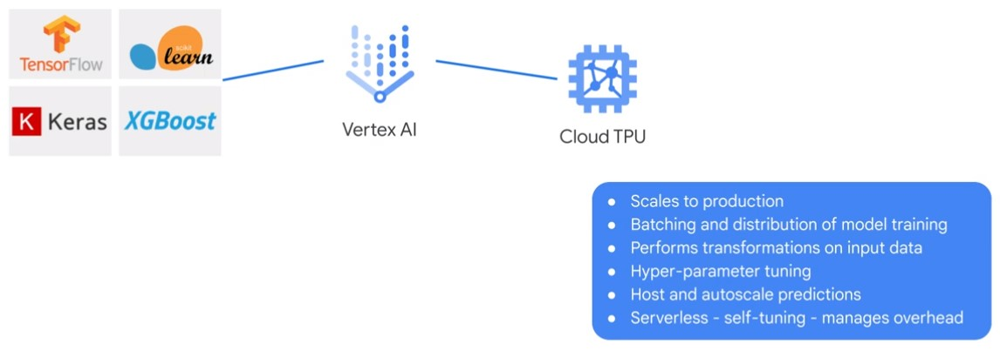
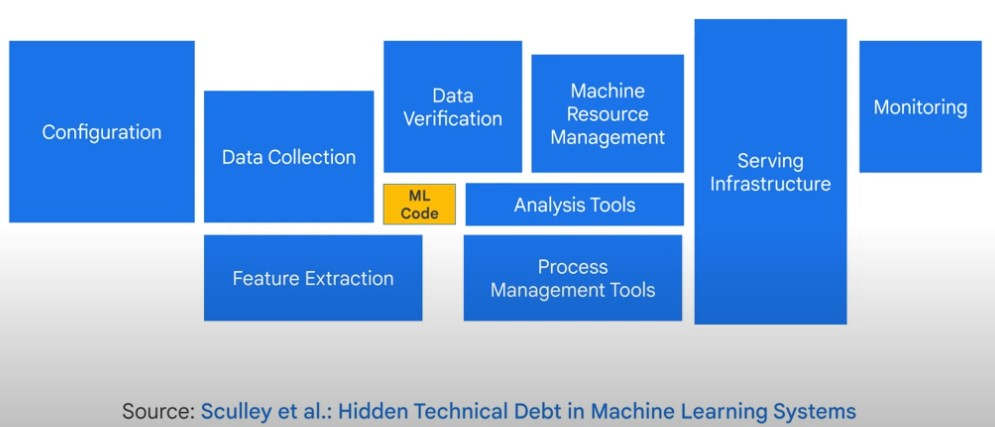
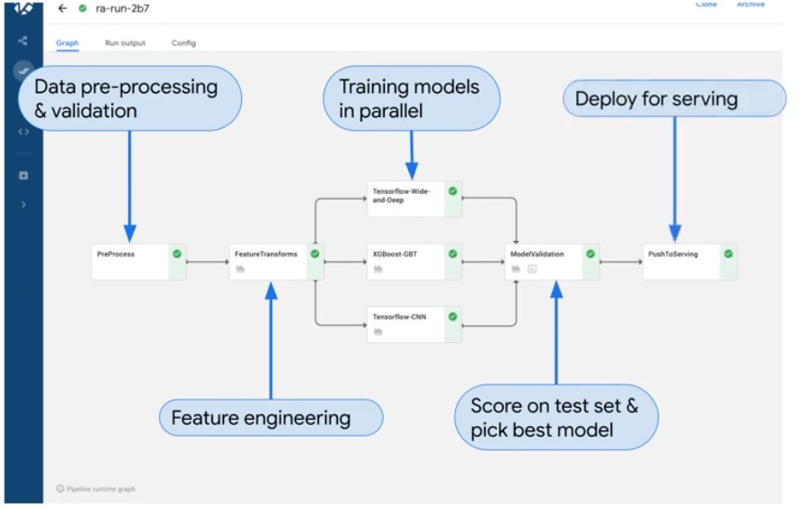

# Kubeflow

## Vertex AI

## Kubeflow

* Leverage containers
* Cloud Native
* Scalable
* On top to Kubernetis
<a/>

* ML Workflow Orchestrations
* Share, Re-user & Compose
* Rapid Experimentation
<a/>

### Pipelines

* Python SDK
<a/>

## AI Hub

Repository for ML components.

* Kubeflow pipelines
* Tensorflow modules
* Trained models
* Services
* VM images
<a/>
