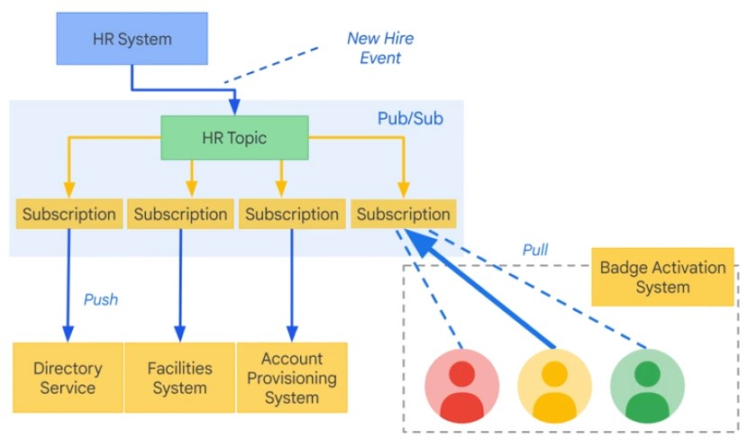
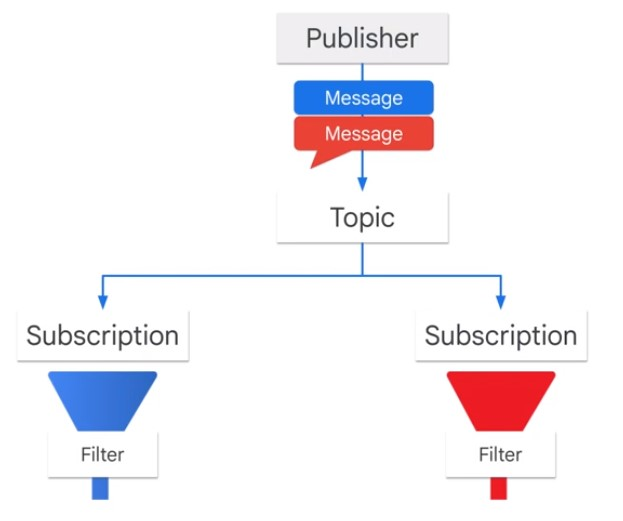
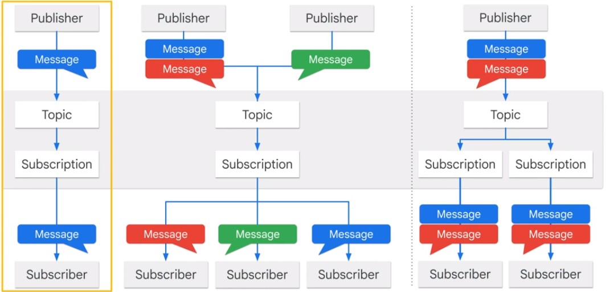
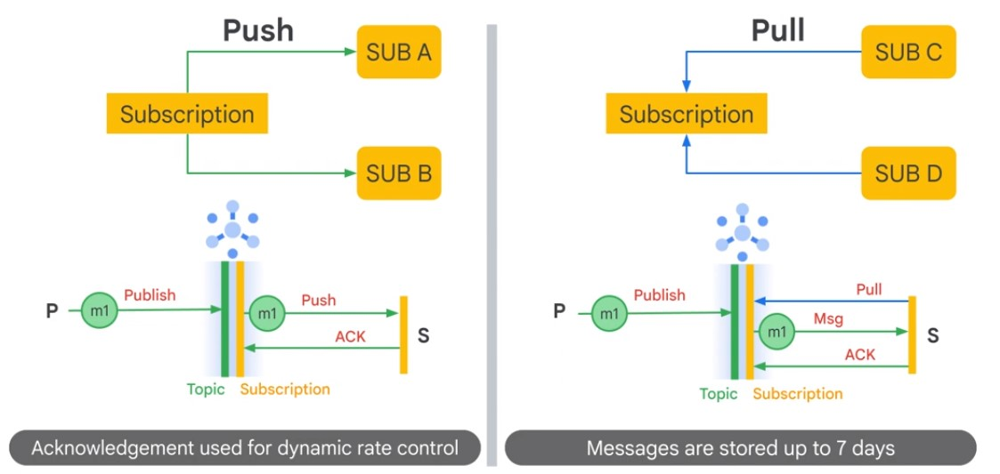
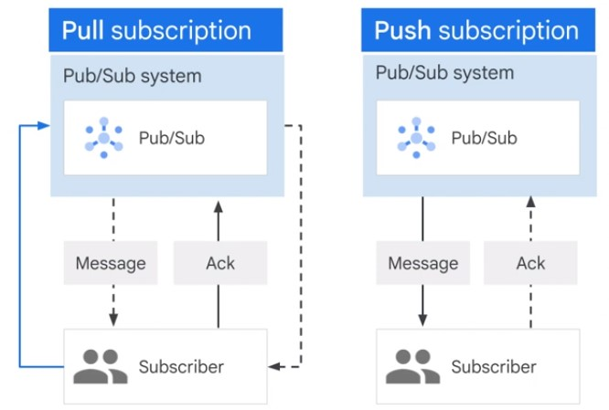
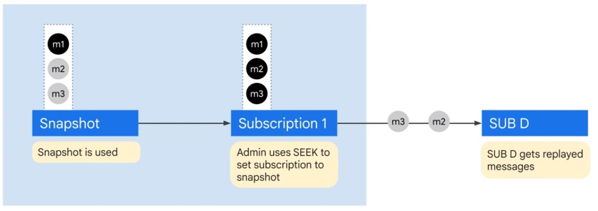
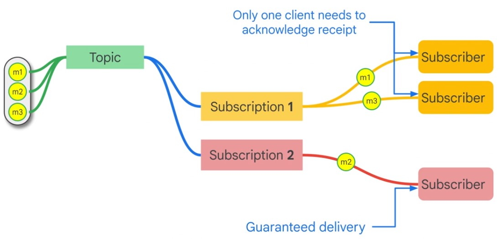
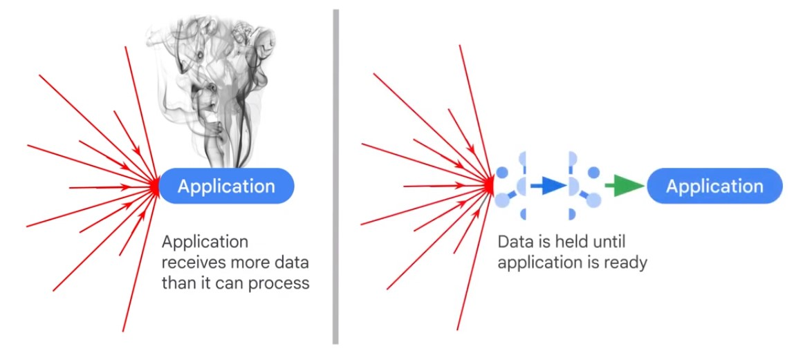
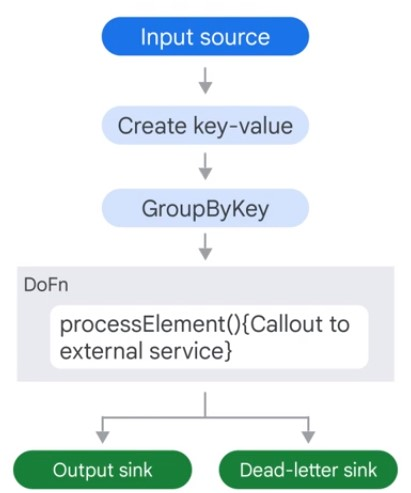
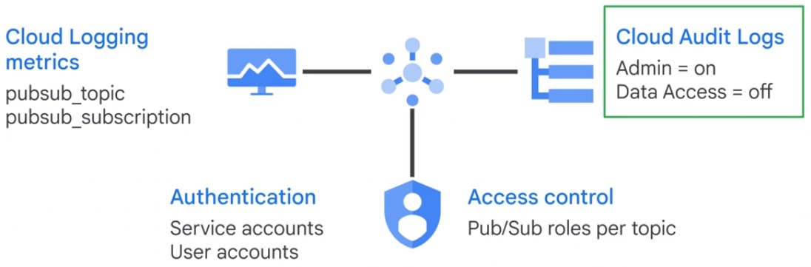

# Pub/Sub

## Introduction

Pubsub is a service. Backbone for Google search engine.

* Availability
* Durability (7 days)
* Scalable (100 Mio Msg/sec)
<a/>

  

You can filter messages by attributes.  

  

## Message Patterns

  

### Push/Pull

  

### Acknowledge

* Subscriber ACKs each message
* Message is resent, if ackDeadline is not met
* Messages are stored for 7 days
* Subscriber can extend deadline

  

### Message Replay

  

### Subscribers single, or in team

  

## Publishing and Subscribing

### Publishing

Pubsub send just raw bytes.

    $ gcloud pubsub topics create sandiego
    $ gcloud pubsub topics publish sandiego --message "hello"
    
    import os
    from google.cloud import pubsub_v1
    
    publisher = pubsub_v1.PublisherClient()
    
    topic_name = 'projects/{project_id}/topics/{topic}'.format(
      project_id = os.getenv('GOOGLE_CLOUD_PROJECT'),
      topic='MY_TOPIC_NAME'
    )
    
    publisher.create_topic(topic_name)
    publisher.publish(topic_name, b'My first message!', author='dylan')
    
### Subscribing Async Pull

    import os
    from google.cloud import pubsub_v1
    
    subscriber = pubsub_v1.SubscriberClient()
    
    topic_name = 'projects/{projecct_id}/topics/{topic}'.format(
      project_id=os.getenv('GOOGLE_CLOUD_PROJECT'),
      topic='MY_TOPIC_NAME'
    )
    
    subscription_name = 'projects/{project_id}/subscriptions/{sub}'.format(
      project_id=os.getenv('GOOGLE_CLOUD_PROJECT'),
      sub='MY_SUBSCRIPTION_NAME'
    )
    
    subscriber.create_subscription(name=subscription_name, topic=topic_name)
    
    def callback(message):
      print(message.data)
      message.ack()
      
    future = subscriber.subscribe(subscription_name, callback)
    
 ### Subscribing Sync Pull
 
    $ gcloud pubsub subscriptions create --topic sandiego mySub1
    $ gcloud pusub subscriptions pull --auto-ack mySub1
    
    import time
    from google.cloud import pubsub_v1
    
    subscriber = pubsub_v1.Subscriber.Client()
    
    subscription_path = subscriber.subscription_path(project_id, subscription_name)
    
    NUM_MESSAGES = 2
    ACK_DEADLINE = 30
    SLEEP_TIME = 10
    
    response = subscriber.pull(subscription_path, max_messages=NUM_MESSAGES)
    
## Message Concepts
    
### Message Batching

By default,  messages are batched. You can turn this off to lower latency.  

    from google.cloud import pubsub
    from google.cloud.pubsub import types
    
    client = pubsub.PublisherClient(
      batch_settings = BatchSettings(max_messages=500)
    )
    
### Message Ordering

Generally, messages are not ordered. You can set the message ordering property. Increases Latency.

### Streaming Resiliance

  

### Dead-letter sink, Error Logging

  

### Exponential Backoff

Increase time to delay messages are sent.

### Security Logging

