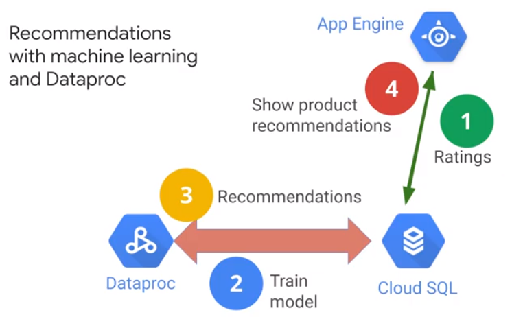

# Recommendation Systems

## Concepts

Data > Model > Infrastructure

Google: RankBrain (ML for search ranking)

? How to find a similar user ?

## Objectives

* Create Cloud SQL instance and populate tables.
* Explore the rentals data using SQL from Cloud Shell
* Launch Dataproc
* Train and apply machine learning model written in PySpark
* Explore inserted rows

## Architecture

? How often should you compute the model ?

Dump user ratings in Hadoop Cluster. About 5 Mio Lines of can be stored in a realational DB.

#

## Create SQL DB

gcp > SQL > Create Instance > MySQL  
Connect to this instance > Cloud SQL

    $ gcloud sql connect rentals --user=root --quiet
    
    mysql> SHOW DATABASES;
    
    mysql> CREATE DATABASE IF NOT EXISTS recommendation_spark;
    mysql> USE recommendation_spark;
    mysql> DROP TABLE IF EXISTS Recommendation;
    mysql> DROP TABLE IF EXISTS Rating;
    mysql> DROP TABLE IF EXISTS Accommodation;
    
    mysql> CREATE TABLE IF NOT EXISTS Accommodation
            (
              id varchar(255),
              title varchar(255),
              location varchar(255),
              price int,
              rooms int,
              rating float,
              type varchar(255),
              PRIMARY KEY (ID)
            );
            
    mysql> CREATE TABLE  IF NOT EXISTS Rating
            (
              userId varchar(255),
              accoId varchar(255),
              rating int,
              PRIMARY KEY(accoId, userId),
              FOREIGN KEY (accoId)
                REFERENCES Accommodation(id)
            );
            
    mysql> CREATE TABLE  IF NOT EXISTS Recommendation
            (
              userId varchar(255),
              accoId varchar(255),
              prediction float,
              PRIMARY KEY(userId, accoId),
              FOREIGN KEY (accoId)
                REFERENCES Accommodation(id)
            );
            
    mysql> SHOW DATABASES;
            
    mysql> USE recommendation_spark;
    mysql> SHOW TABLES;
    mysql> SELECT * FROM Accommodation;
      
 ## Stage Data in Cloud Storage
 
 Check, if cloud storage bucket exists:  
 gcp > Storage > Cloud Storage > Browser > Create Bucket
 
    $ echo "Creating bucket: gs://$DEVSHELL_PROJECT_ID"
    $ gsutil mb gs://$DEVSHELL_PROJECT_ID
    $ echo "Copying data to our storage from public dataset"
    $ gsutil cp gs://cloud-training/bdml/v2.0/data/accommodation.csv gs://$DEVSHELL_PROJECT_ID
    $ gsutil cp gs://cloud-training/bdml/v2.0/data/rating.csv gs://$DEVSHELL_PROJECT_ID
    $ echo "Show the files in our bucket"
    $ gsutil ls gs://$DEVSHELL_PROJECT_ID
    $ echo "View some sample data"
    $ gsutil cat gs://$DEVSHELL_PROJECT_ID/accommodation.csv
    
## Load data from Cloud Storage to SQL

gpc > SQL > rentals > import

## Launch Dataproc

gpc > Dataproc > create Cluster

Configure Nodes:
* Master: n1-standard-2
* Worker: n1-standard-2
<a/>

    $ echo "Authorizing Cloud Dataproc to connect with Cloud SQL"
    CLUSTER=rentals
    CLOUDSQL=rentals
    ZONE=us-central1-c
    NWORKERS=2
    machines="$CLUSTER-m"
    for w in `seq 0 $(($NWORKERS - 1))`; do
       machines="$machines $CLUSTER-w-$w"
    done
    echo "Machines to authorize: $machines in $ZONE ... finding their IP addresses"
    ips=""
    for machine in $machines; do
        IP_ADDRESS=$(gcloud compute instances describe $machine --zone=$ZONE --format='value(networkInterfaces.accessConfigs[].natIP)' | sed "s/\['//g" | sed "s/'\]//g" )/32
        echo "IP address of $machine is $IP_ADDRESS"
        if [ -z  $ips ]; then
           ips=$IP_ADDRESS
        else
           ips="$ips,$IP_ADDRESS"
        fi
    done
    echo "Authorizing [$ips] to access cloudsql=$CLOUDSQL"
    gcloud sql instances patch $CLOUDSQL --authorized-networks $ips

gpc > SQL > Pulic IP Address '35.188.24.164'

## Run ML Model

    $ gsutil cp gs://cloud-training/bdml/v2.0/model/train_and_apply.py train_and_apply.py
    cloudshell edit train_and_apply.py
    
Change IP Address in Line 30. 

    $ gsutil cp train_and_apply.py gs://$DEVSHELL_PROJECT_ID
    
gpc > Dataproc > Clusters > rental > Submit Job

* Job type: PySpark
* Main python file: gs://qwiklabs-gcp-04-f016ca343a1f/train_and_apply.py

## Explore

    $ gcloud sql connect rentals --user=root --quiet
    mysql > USE recommendation_spark;
    mysql > SELECT COUNT(*) AS count FROM Recommendation;
    
    mysql > SELECT
        r.userid,
        r.accoid,
        r.prediction,
        a.title,
        a.location,
        a.price,
        a.rooms,
        a.rating,
        a.type
    FROM Recommendation as r
    JOIN Accommodation as a
    ON r.accoid = a.id
    WHERE r.userid = 10;
