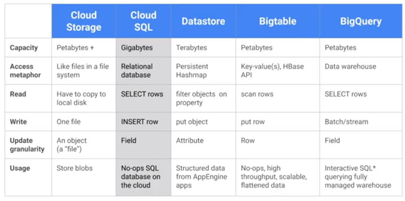
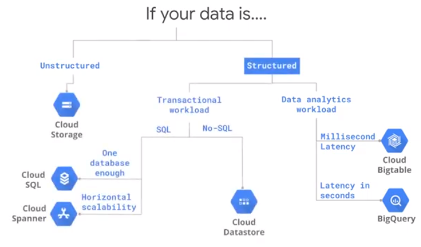
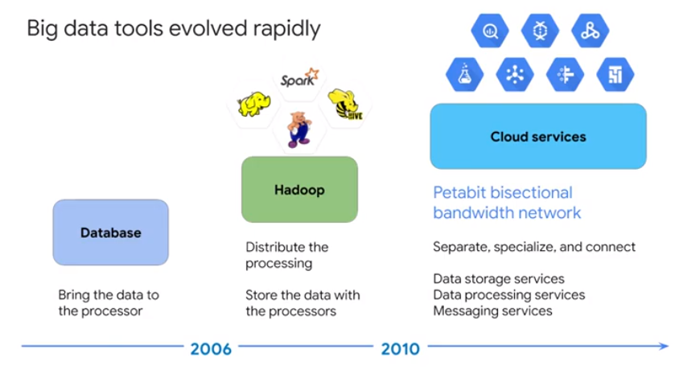
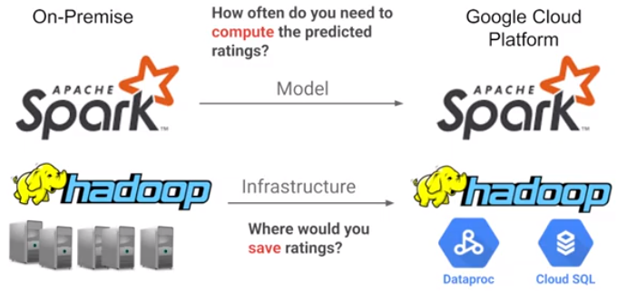
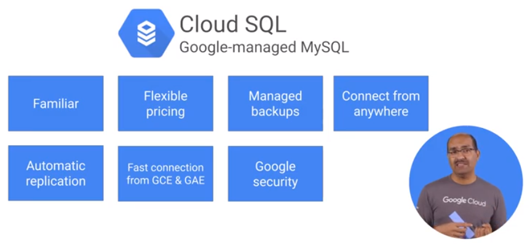
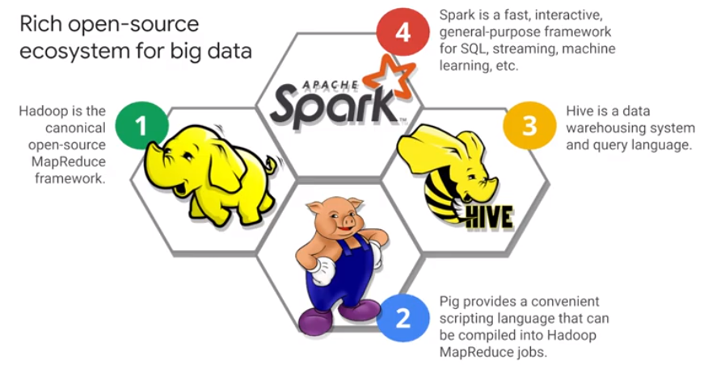
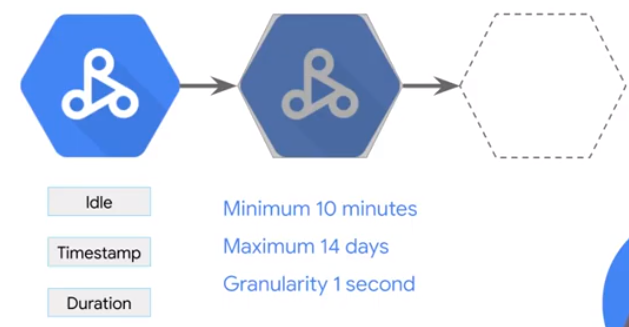
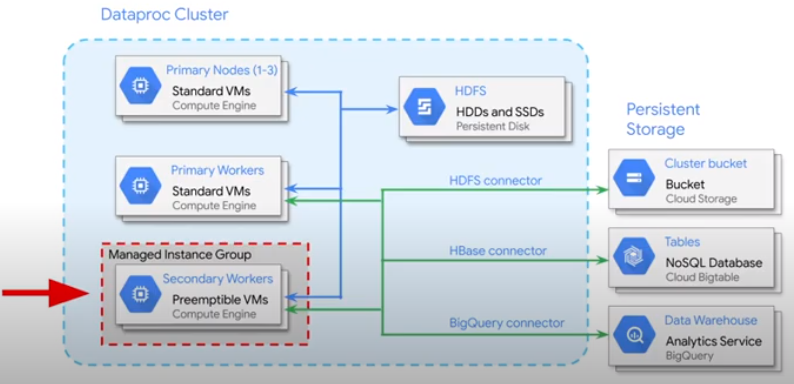
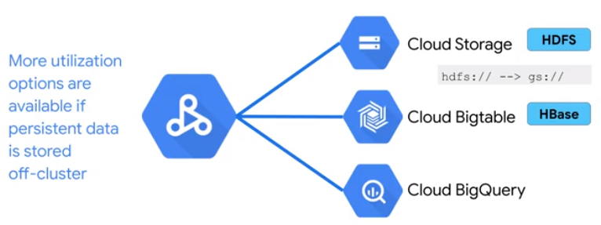

# GCP Storage Types

How to choose a storage solution?

  

Evolution Big Data Tools

Transfer On-Premise to Google Cloud.

Store recommendations to Cloud SQL.

Run Open Source Big Data Tools on Cloud Dataproc

Clusters are flexible ressources that can be used and destroyed on demand.

  

Do not store data in the cluster, to make autoscaling possible! Store data in google cloud storage.

