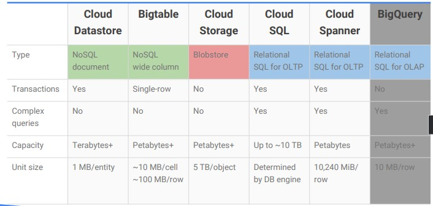
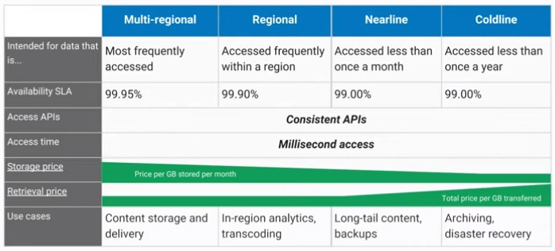

# GCP Storage Types

How to choose a storage solution?

  

## [Cloud Storage](cloudstorage.md)

* High performance, internet-scale
* Simple administration (Does not reqire capacity management)
* Data encryption at rest
* Data encryption in transit by default from Google endpoint
* Online and offline import services are available
* Tightly integrated with other services
<a/>

|Bucket attributes|Bucket contents|
|-|-|
|Globally unique name|Files (in a flat namespace)|
|Storage class (Mulit-regional, Regional, Nerline, Coldline)||
|Location (region of multi-region)||
|IAM policies or Access Cotnroll Lists|Access Control Lists|
|Object versioning settings||
|Object lifecycle management rules||

### Get Data into Cloud Storage

* Online Transfer (Self-managed, Command-line tools like gsutil)
* Storage Transfer Service (Scheduled batch transfers)
* Transfer Appliance (Rackable applicances)
<a/>

## [Cloud Bigtable](bigtable.md)

* Fully managed NoSQL, wide-column database service for terabyte applications
* NoSQL Schema. Not all columns have same datatype. Sparsely populated tables.
* Integrated (HBase API, Mative compatibility with big data, Hadoop)
* Compatibility to HBase
  * Bigtable is scaleable
  * Admin Tasks transparent
  * Same Database as Google Core Services
<a/>

### When to choose Cloud BigTable

* Replicated storage
* Data encryptino in-flight and at rest
* Role-based ACLs
* Drives major applications
* IoT, User Analytics, Financial Analytics
<a/>

* Big > 1TB
* Fast
* NoSQL
* Time series
* Big data
* Machine Learning
<a/>

## Cloud SQL

* MySQL and PostgreSQL
* Automatic replication
* Managed backups
* Vertical scaling
* Horizontal scaling
* Google security
<a/>

## Cloud Spanner

* Horizontally scalable RDBMS
* Automatic replication
* Strong global consistency
* Managed instances with high availability
* SQL
<a/>

* Database >2TB
<a/>

## Cloud Datastore

* NoSQL designed for aplication backends
* Fully managed
* Built-in redundancy
* Supports [ACID](https://en.wikipedia.org/wiki/ACID) transactions
<a/>

* Schemaless access
* Local development tools
* Includes a free daily quota
* Access from anywhere though a  [RESTful](https://cloud.google.com/datastore/docs/apis) interface
<a/>

