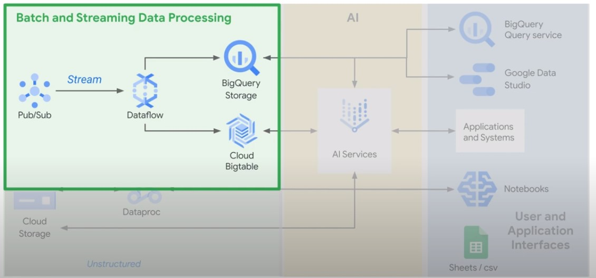
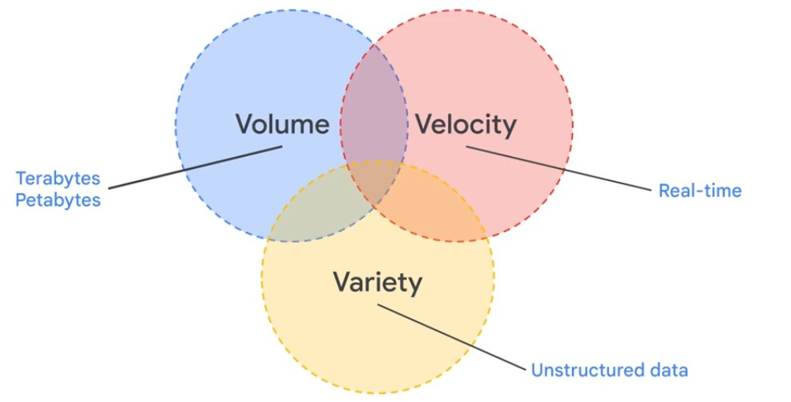
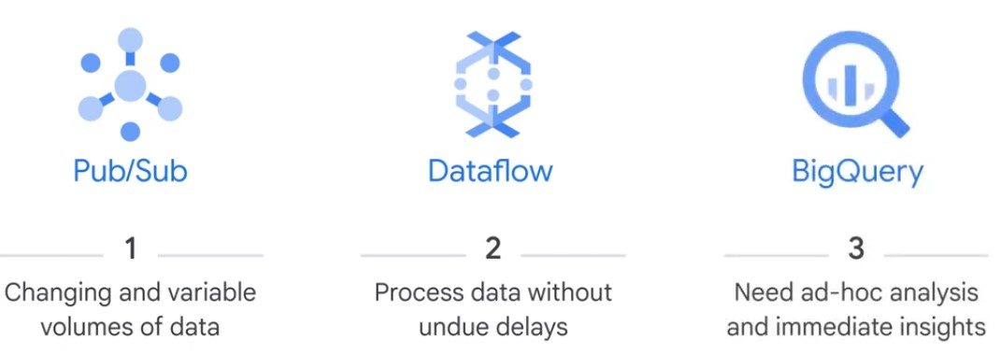
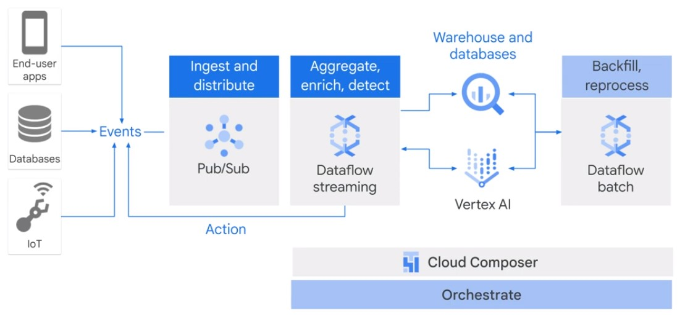

# Streaming Data Processing

|Bounded Data (Batch)|Unbounded Data (Stream)|
|-|-|
|Finite data set|Infinite data set|
|Complete|Never complete|
|Time of element is disregarded|Time of element is siginificant|
|in rest|in motion|
|Durable storage|Temporary storage|

|Data Integration (10sec - 10min)|Data decisions (100ms - 10sec)|
|-|-|
|Data warehouse real-time|Real-time recommendations|
||Fraud detection|
||Gaming events|
||Finance back office|

* Volume: Autoscaling
* Velocity: Streaming Processing
* Variety: AI
<a/>

  

