# ML on Unstructured Data

ML can automate tasks.

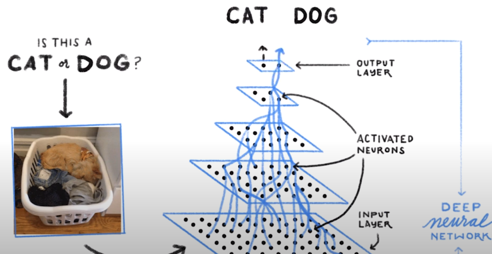

Different approaches to AI. You need 100k+ Datapoints to train your own model.

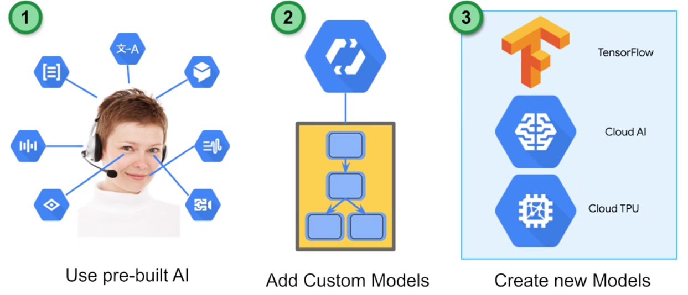

# Prebuild Models

## Vision API

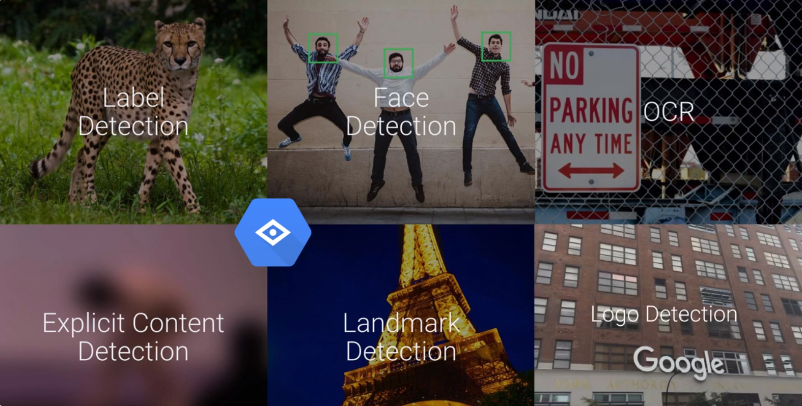

## Translate API

## Language API

Sentiment Analysis

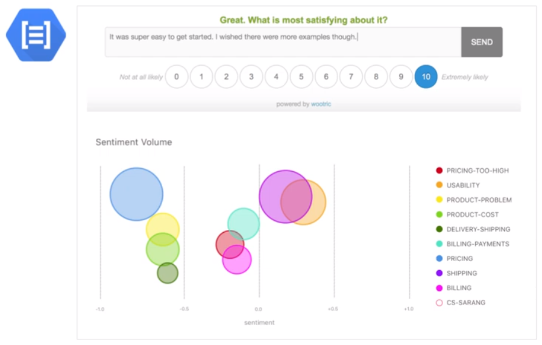

## Speech API

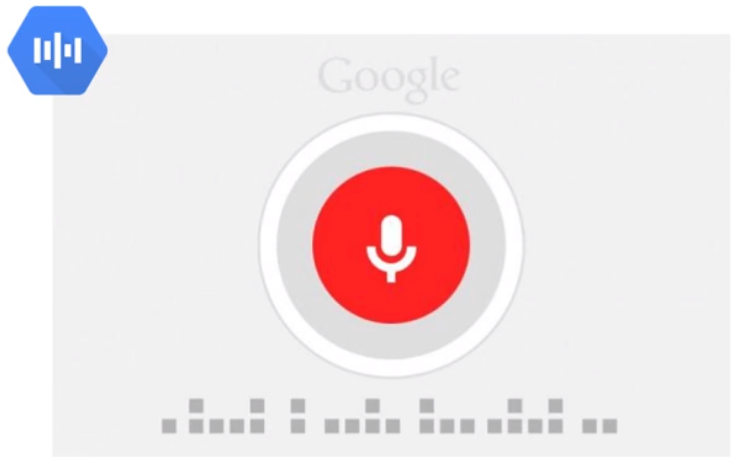

## Video Intelligence API

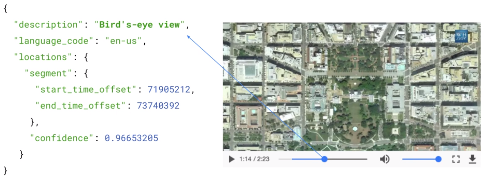

# Dialog Flow

Natural Language understanding API.

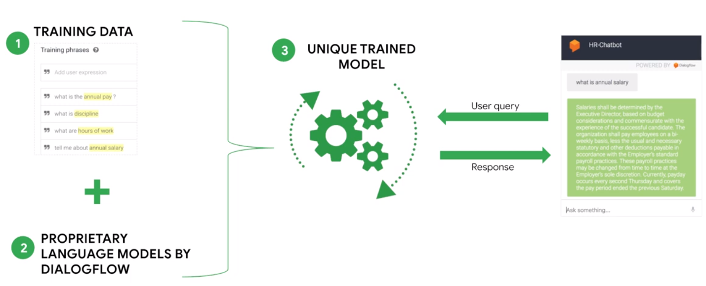

Prebuilt Chatbots

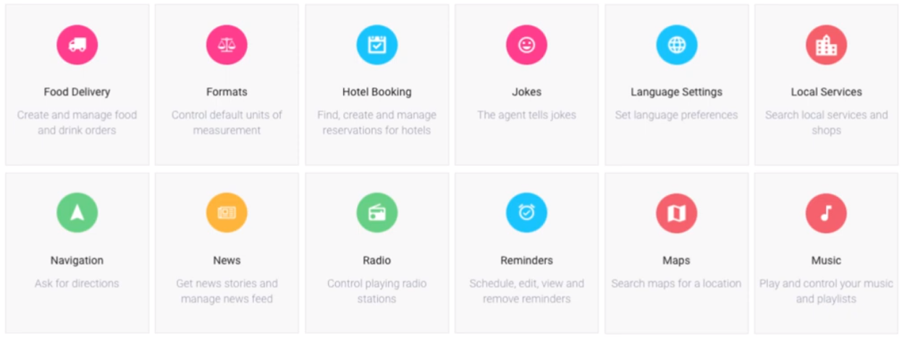

# AutoML

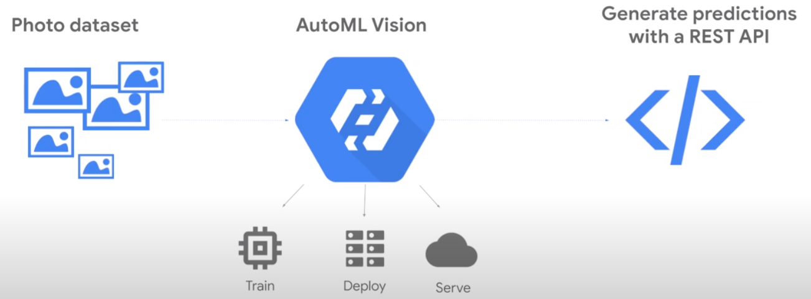  
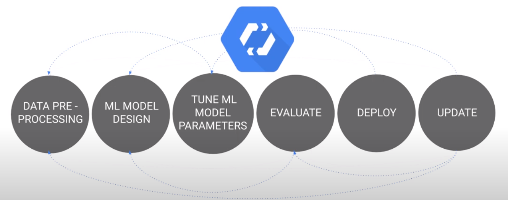  
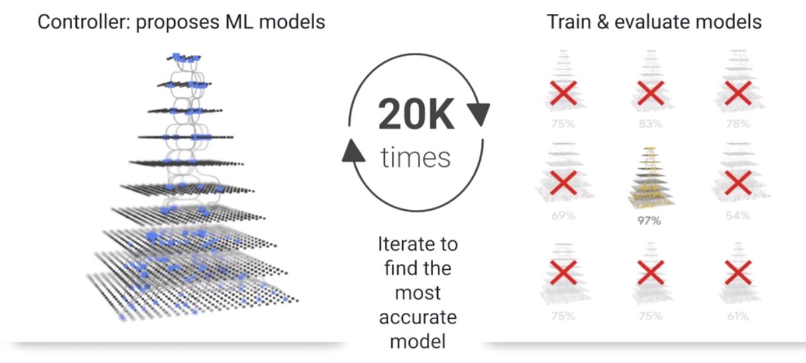  

|Attribute|AutoML Vision|Visoin API|
|-|-|-|
|Objective|Enabling developers with no ML expertise to build ML models|Enable ML practitiones to use Googles ML|
|Primary use|Classification|Face detection, OCR ...|
|Data|Images with Labels|Justt Images|

