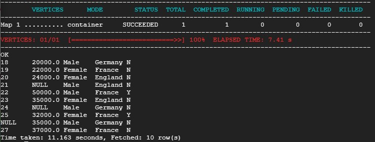

# HIVE
  
Hive > MapReduce > YARN > HDFS  

Hive can only work on structured data. It stores metada in a relational database called 'Hive metastore'. It does not create database tables, but uses pointers to datasources stored in HDFS directories.
  
GCP > DataProc > create Cluster  

    $ hadoop fs -mkfir /user/newuser
    $ hadoop fs -mkfir /user/newuser/retaildata
    $ wget https://raw.githubusercontent.com/futurexskill/bigdata/master/retailstore.csv
    $ hadoop fs -put retailstore.csv /user/newuser/retaildata/
    $ hive
    hive> show databases;
    hive> create database futurex;
    hive> use futurex;
    hive> show tables;
    hive> create table retailcust (age INT, salary FLOAT, gender String, country String, purchased String) ROW FORMAT DELIMITED FIELDS TERMINATED BY ',' LOCATION '/user/newuser/retaildata/' TBLPROPERTIES ("skip.header.line.count"="1");
    hive> selecct * from retailcust;

A 'drop table' command delets also the hdfs subdirectory in which the csv files were stored. To prevent this from happening, use the 'external' keyword.  
  
    hive> create external table retailcustext (age INT, salary FLOAT, gender String, country String, purchased String) ROW FORMAT DELIMITED FIELDS TERMINATED BY ',' LOCATION '/user/newuser/retaildata/' TBLPROPERTIES ("skip.header.line.count"="1");
    
## Improve Query Performance

* Partitioning: Discrete values
* Bucketing: Continuous values
<a/>

GCP > DataProc > create Cluster

    $ wget https://github.com/mayrhofer_b/bigdata/raw/master/retailstore_large.zip
    $ unzip retailstore_large.zip
    $ hadoop fs -mkfir /user/newuser
    $ hadoop fs -mkfir /user/newuser/retailcust
    $ hadoop fs -put retailstore_large.csv /user/newuser/retailcust
    $ hadoop fs -ls retailcust
    
    $ hive
    hive> create database if not exists retailcust;
    hive> use retailcust;
    hive> create external table retailcustext_large (customerid INT, age INT, salary FLOAT,gender String,country String) ROW FORMAT DELIMITED FIELDS TERMINATED BY ',' LOCATION '/user/mayrhofer_b/retailcust/' TBLPROPERTIES ("skip.header.line.count"="1") ;
    hive> select count(*) from retailcustext_large where country = 'Germany';

### Partition

Hive creates subdirectories for every country.

    hive> set hive.exec.dynamic.partition=true;
    hive> set hive.exec.dynamic.partition.mode=nonstrict;
    hive> create external table retailcustext_large_partitioned (customerid INT, age INT, salary FLOAT,gender String) partitioned by (country String) location  '/user/mayrhofer_b/retailcust-partitioned/';
    hive> insert into table retailcustext_large_partitioned partition(country) select * from retailcustext_large;
    hive> show partitions retailcustext_large_partitioned;
    hive> select count(*) from retailcustext_large_partitioned where country = 'Germany';
    
### Bucket

Hive creates a new file for each bucket

    hive> create external table retailcustext_large_bucketed3 (customerid INT, age INT, salary FLOAT,gender String,country String) clustered by (customerid) into 20 buckets location  '/user/futurexskill/retailcust-bucketed3/';
    hive> from retailcustext_large insert into table retailcustext_large_bucketed3 select customerid,age,salary,gender,country;
  
# Terminate Cluster
  
GCP > DataProc > select Cluster > delete
