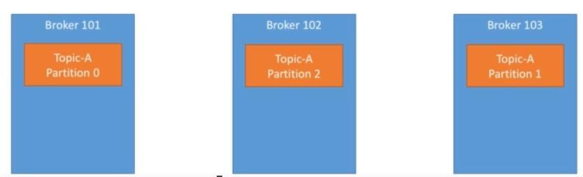
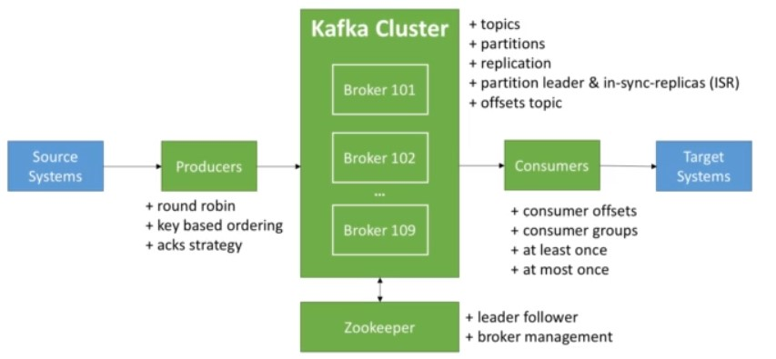

# General

* Topic: a particular stream of data (like a table in a relational db)
  * Replication Factor: How often is a certain topic distributed on the Kafka cluster?
  
* Partition: Topics are split in partitions (Arbitrary number). Each partition is ordered.
  * Offset: A partitions incremental id
  * Data is deleted after some time
  * Data is immutable

* Broker: A Kafka cluster is composed of multible brokers (servers)
  * ID: Each broker has its own id. Each broker contains certain topic partitions
  * A good amount to start is 3 brokers
  * Only a single broker can be a leader for a specific partition. The other brokers synchronise the data (ISR in-sync-replica).
  * Each brokers knows about the other brokers

* Producer: Writes data to topics
  * Loadbalancing between brokers
  * Message Keys: If null > round robin, If key is send data gets always to the same partition. Key can be any string. Kafka ensures that data for a specific key is always written to the same partition and is therefore sorted.
  * As long as the number of partitions is unchanged, the same key will go to the same partition.
    
* Consumers
  * Read data from a topic
  * Groups: Consumers read data in groups
  * No Consumers > No Partitions: Some consumers are inactive
  * Offset: Each consumer group has its own offsets. Stored in a Kafka Topic
  * Delivery Semantics: At most once, At least one (preferred), Exactly once

* Zookeper
  * Manages brokers (keeps a list of them)
  * Kafka cannot work without Zookeeper
  

