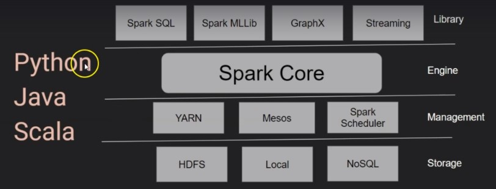

# Spark Concept

In an HDFS context, Hive writes its tables on disks, which reduces speed. Spark keeps its data in memory, to improve performance. Spark can be used for batch processing and datastreaming.  
Spark is written in Scala.  

Hive > MapReduce > YARN > HDFS  
Spark > YARN|Mesos > HDFS|AWS|Azure|Blob|Relational DB|No SQL  

            Driver Program
            Spark Session
            |
    |-------|-------|
    Worker  Worker  Worker

# Cloud Setup

GCP > Dataproc > Create a Cluster > SSH

    $ wget https://raw.githubusercontent.com/futurexskill/bigdata/master/retailstore.csv
    $ hadoop fs -mkdir /user/newuser
    $ hadoop fs -mkdir /user/newuser/data
    $ haddop fs -put retailstore.csv data/

## Read CSV

    $ pyspark
    >>> spark.read.csv("data/retailstore.csv").show()
    >>> spark.read.option("header","True").csv("data/retailstore.csv").show()
    
    +----+------+------+-------+---------+
    | Age|Salary|Gender|Country|Purchased|
    +----+------+------+-------+---------+
    |  18| 20000|  Male|Germany|        N|
    |  19| 22000|Female| France|        N|

## Read Hive Table Python
 
    $ hive
    hive> create database if not exists retail;
    hive> use retail;
    hive> create table retailcust (age int, salary float, gender string, country string, purchased string) row format delimited fields terminated by ',' location '/user/newuser/data/' tblproperties ("skip.header.line.count"="1");
    
    $ spark
    >>> spark.sql("select * from retail.retailcust").show()

## Read Hive Table Scala

    $ spark-shell
    scala> spark.read.option("header","true").csv("data/retailstore.csv").show()
    
    +----+------+------+-------+---------+
    | Age|Salary|Gender|Country|Purchased|
    +----+------+------+-------+---------+
    |  18| 20000|  Male|Germany|        N|
    |  19| 22000|Female| France|        N|
    
    scala> spark.sql("select * from retail.retailcust").show()
