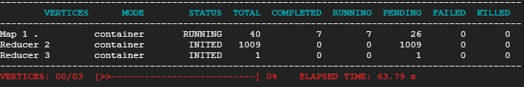

# Create GCP Cluster

GCP > DataProc > Create Cluster  
Cluster > VM Instances > SSH  

# Upload Data to Cluster

Create 1bn records:

    $ wget https://github.com/futurexskill/bigdata/raw/master/retailstore_5mn.zip
    $ unzip retailstore_5mn.zip
    $ head reatilstore_5mn.csv
    $ for i in {1..200}; do cp retailstore_5mn.csv "retailstore_5mn_$i.csv"; done

    $ hadoop fs -mkdir /user/newuser
    $ hadoop fs -mkdir /user/newuser/data
    $ for i in {1..200}; do hadoop fs -put "retailstore_5mn_$i.csv" data; done

# Analyse Data with Hive

## Create Table

    $ hive
    hive> create database retail;
    hive> use retail;
    hive> create external table retailcust (age INT, salary FLOAT, gender String, country String, purchased String) ROW FORMAT DELIMITED FIELDS TERMINATED BY ',' LOCATION '/user/newuser/retaildata/' TBLPROPERTIES ("skip.header.line.count"="1");
    hive> select * from retailcust limit 10;
    
## Query Average Sales per Country

    $ hadoop fs -mkdir country
    hive> create external table countryavgsalary (country String, avg_salary double) ROW FORMAT DELIMITED FIELDS TERMINATED BY ',' LOCATION '/user/newuser/country/' TBLPROPERTIES ("skip.header.line.count"="1");
    hive> insert into countryavgsalary select country, avg(salary) from retailcust group by country;
    

    hive> select * from countryavgsalary;

You can save the code in a sql file using the nano text editor.

    $ nano countryavgsalary.sql
    
    use retail;
    insert into countryavgsalary select country, avg(salary) from retailcust group by country;
    
    $ hive -f countryavgsalary.sql
    
